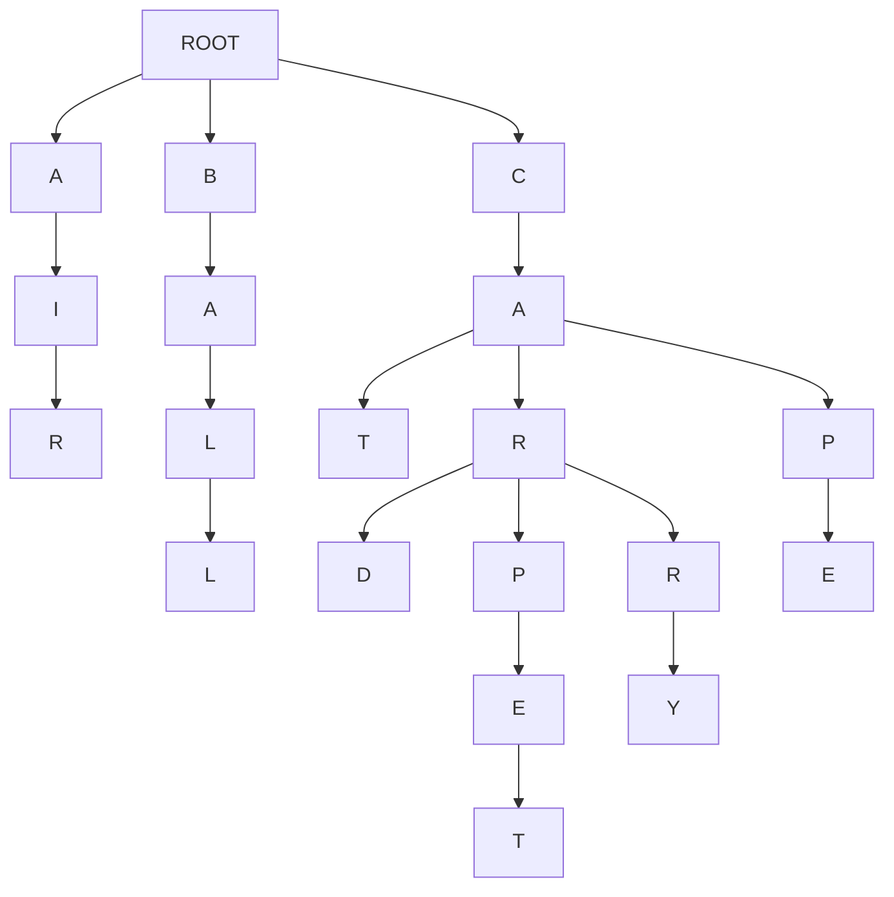
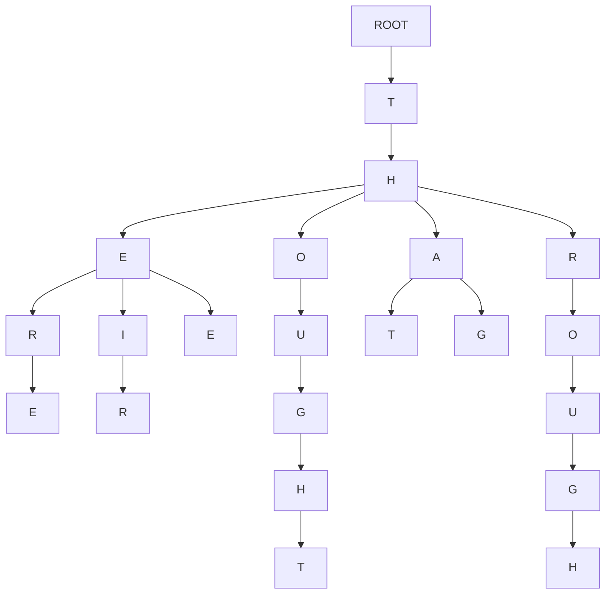

# Search-Wizard


## Objectives

1) Learn how to implement search algorithms in python
2) Learn how search algorithms can be used in practical application
3) Learning the differences between BFS, DFS, and UCS via implementation
4) Analyze the differences between search algorithms by comparing outputs
5) Learning how to build a search tree from textual data
6) Build a basic autocomplete feature that suggests words as the user types, using different search strategies.
7) Analyze how each algorithm affects the order and quality of suggestions, and learn when to choose each one.

## Pre-Requisites

- **Basic Python:** Familiarity with Python syntax, data structures (lists, dictionaries, queues), and basic algorithms.
- **Search Algorithms:** Theoretical understanding of BFS, DFS, and UCS
- **Tree:** Prior knowledge of Tree data structures is helpful.
- **Data Structures:** High level understanding of Data Structures like Stacks, Queues, and Priority Queues is required.

## Overview
Imagine you're an intern at a cutting-edge tech company called "WordWizard." Your first task: upgrade their revolutionary messaging app, "ChatCast," to include a mind-blowing autocomplete feature. The goal is simple – as users type, the app magically suggests the words they might be looking for, making conversations faster and more fun!

But here's the twist: Your quirky, genius boss, Dr. Lexico, insists on using classic search algorithms to power this futuristic feature. "Forget fancy neural networks," she exclaims. "Let's prove that good old BFS, DFS, and UCS can still deliver the goods!"

So, you're handed a massive dictionary of Gen Z slang and challenged to build the autocomplete engine. Can you master the algorithms, construct a word-filled tree, and unleash the power of search to create an autocomplete experience that will make even the most texting-savvy teen say, "OMG, this is lit!"?

The future of "ChatCast" (and your internship) depends on it. Time to dive into the code and become a word-suggesting wizard! 

## Lab Description

1. **First step**
    - Clone the repo and run `main.py`
      ```bash
      python main.py
      ```
    - If you're on linux/mac and the former doesn't work for you
      ```bash
      python3 main.py
      ```
      
      
2.  **Explore the Starter Code:**
    - Review the provided `Autocomplete` class. It handles building the tree from a text document, setting up a basic user interface, and providing a framework for the `suggest` method.
3.  **Implement Search Algorithms:**
    - Your main task is to complete the `suggest` methods. These methods should take a prefix as input and return a list of word suggestions. 
    - You'll implement multiple versions of `suggest`:
        - `suggest_bfs`: Breadth-First Search
        - `suggest_dfs`: Depth-First Search
        - `suggest_ucs`: Uniform-Cost Search  


## Background: Autocomplete as a Search Problem

Alright! Let's give you some context before you get into the weeds of the starter code. 
Autocomplete might seem like some complicated magic, but at its core, it's just an application of search algorithms on a tree (that's how it's done in this assignment for your simplicity, but it's done very differently in real word). Let's break down how this works:

**The Search Space: A Tree of Characters**

To implement the autocomplete feature, you would build a tree of characters, which will be the search space for this search problem. 
In your starter code, you're given a `document` (a `txt` file) of several words. 
Imagine each word in your document is broken down into its individual letters. Now, picture these letters arranged in a single tree-like structure, for example look at the tree diagram below:


**Tree Diagram**

For example, let the document that is given to you be - 

```txt
air ball cat car card carpet carry cap cape
```




Above is a diagram of the tree that is build from the example `document` given above. Note how the *tree* starts with a common `root` 

- This is what the search space for your search problem would look like. 
- You will traverse the *tree* starting from the last node of the prefix that the user enters to generate autocomplete suggestions. 

**The Search Problem**

When a user types a prefix (e.g., "ca"), the autocomplete feature needs to find all the words in the *tree* that start with that prefix. This translates to a search problem:

- **Initial state:** The node representing the last letter of the prefix ("a" in our example).
- **Action** - a transition between one letter to the next letter in the *tree*
- **Goal:** The end of the word(s) (that start with the given prefix) in the *tree*. <u>Note how there could be multiple goals in this problem.</u>
- **Path:** The sequence of characters from the root to a goal node represents a complete word.

**Search Algorithms**

We can employ various search algorithms to traverse this *tree* and find our goal nodes (complete words).

- **Breadth-First Search (BFS):**  Explores the *tree* level-by-level, ensuring we find the shortest words first. 
- **Depth-First Search (DFS):** Dives deep into the *tree*, potentially finding longer, less common words first.
- **Uniform-Cost Search (UCS):** Considers the frequency of each character transition to prioritize more likely words based on the prefix.

**Multiple Goals and Paths**

In autocomplete, we're not just looking for a single goal node. We want to find *all* the goal nodes (words) that follow from the prefix. Furthermore, we're interested in the entire path from the root to each goal node, as this path represents the complete suggested word.

**Your Task:**

Your task is to implement BFS, DFS, and UCS to traverse the *tree* and generate autocomplete suggestions. You'll see how different algorithms affect the order and type of words suggested, and understand the trade-offs involved in choosing one over the other.


## Starter Code
For the starter code you have been given 3 files - 
1. **`autocomplete.py`** - This is where all your code that you write will go.
2. **`main.py`** - This file is responsible to setting up and running the autocomplete feature. Modifying this file is optional. Feel free to use this file for debugging or playing around with the autocomplete feature.
3. **`utilities.py`** - This file contains the code to read the document provided and building the Graphical User Interface for the autocomplete feature. This file is not related to the core logic of the autocomplete feature. Please do not modify this file.

### `autocomplete.py`
- This file has a `Node` class defined for you - 
    - Each Node represents a single character within a word. The `Node class has 1 attribute - 
        1. `children` - This is a dictionary that stores - 
            - Keys - Characters that which follow the current character in a word.
            - Values - `Node` objects, representing the next character in the sequence. 
    **You might (most likely will) want the `Node` class keep track of more things depending on how you implement you `suggest` methods.**

- The file also has an `autocomplete` class defined for you - 
    - The Engine Behind the Suggestions
    - **Attributes**
        - `root`: A root node of the tree. The tree stores all the words of the document in a tree structure, where each `Node` is character.
    - **Methods**
        - `__init__(document="")`:
            - Initializes an empty tree (the `root` node).
            - If a `document` string is provided, it builds the tree from that document.
            - document is a space separated textfile, example below.
            - ```txt
              air ball cat car card carpet carry cap cape
              ``` 
        - `build_tree(document)` #TODO:
            - As the name of the function suggests, takes a text string `document` and builds a tree of words, where each `Node` is a character. 
            - The implementationn of this method has been left up to you.

## **Student Tasks:**
The main goal of the lab activity is for students to implement the `build_tree`, `suggest_bfs`, `suggest_ucs`, and `suggest_dfs` methods. 


### 0. TODO: Intuition of the code written
- For all code that you will write for this assignment (which is not a lot), you must provide a breif intuition (1-2 sentences) of the major control structures of your code in the reports section at the bottom of this readme.
- You are not being asked to write a story, keep it concise and precise (remember, 1-2 sentences, at most 3).

**Consider the `fizz-buzz` code given below:**

```python
def fizzbuzz(n):
    for i in range(1, n + 1):
        if i % 15 == 0:
            print("FizzBuzz")
        elif i % 3 == 0:
            print("Fizz")
        elif i % 5 == 0:
            print("Buzz")
        else:
            print(i)

```

**Now this is what you're explaination should (somewhat) look like -**

<u>Iterates through a range of numbers n printing that number unless the number is a multiple of 3 or 5 where instead "Fizz" or "Buzz" is printed respectively. "FizzBuzz" is printed if the number is a multiple of both 3 and 5.</u>


### 1. TODO: `build_tree(document)`

>[!NOTE]
>**TODO: Draw the tree diagram of test.txt given in the starter code**
    - Upload the image into your `readme` into the reports section in the end of this readme.


**What it does:**

- Takes a text `document` as input.
- Splits the document into individual words.
- Inserts each word into a tree (prefix tree) data structure.
- Each character of a word becomes a node in the tree.

**Your task:**

- Complete the `for` loop within the `build_tree` method.


### 2. TODO: `suggest_bfs(prefix)`

**What it does:**

- Implements the Breadth-First Search (BFS) algorithm on the tree.
- Takes a `prefix` (the letters the user has typed so far) as input.
- Finds all words in the tree that start with the `prefix`.

**Your task:**
- Start from the node that corresponds to the last character of the `prefix`.
- Using BFS traverse the sub tree and build a list of suggestions.
- **Run your code with the `genZ.txt` file and `suggest_bfs()` method that you just implemented with the prefix `"th"` and note the the autocompleted suggestions it generates in the *Reports Section* below. Make sure you note down the suggestions in the same order in which they are originally displayed on your screen.**

### 3. TODO: `suggest_dfs(prefix)`

**What it does:**

- Implements the Depth-First Search (DFS) algorithm on the tree.
- Takes a `prefix` as input.
- Finds all words in the tree that start with the `prefix`.

**Your task:**
- Start from the node that corresponds to the last character of the `prefix`.
- Using DFS traverse the sub tree and build a list of suggestions.
- **Explain your intuition in recursive DFS VS stack-based DFS, and which one you used. Write this in the section provided at the end of this readme.**
- **Run your code with the `genZ.txt` file and `suggest_dfs()` method that you just implemented with the prefix `"th"` and note the the autocompleted suggestions it generates in the *Reports Section* below. Make sure you note down the suggestions in the same order in which they are originally displayed on your screen.**

### 4. TODO: `suggest_ucs(prefix)`

**What it does:**

- Implements the Uniform Cost Search (UCS) algorithm on the tree.
- Takes a `prefix` as input.
- Finds all words in the tree that start with the `prefix`.
- Prioritizes suggestions based on the frequency of characters appearing after previous characters.

**Your task:**

- Update `build_tree()` to store the path cost. The path cost is the inverse frequencies of that letter/char following that prefix of characters.
    - Using the inverse of these frequencies creates a lower path cost for more frequent character sequences.    
- Start from the node that corresponds to the last character of the `prefix`.
- Using UCS traverse the sub tree and build a list of suggestions.
- **Run your code with the `genZ.txt` file and `suggest_ucs()` method that you just implemented with the prefix `"th"` and note the the autocompleted suggestions it generates in the *Reports Section* below. Make sure you note down the suggestions in the same order in which they are originally displayed on your screen.**

<br>

>[!NOTE]
>This is not optional
> Try experimenting with different approaches and compare the results! Try typing different prefixes in the GUI and observe how the suggested words change depending on which search algorithm you're using. This will help you gain a deeper understanding of their strengths and weaknesses.<br>
> **Note down these observations in the reports section provided at the end of this readme**


## What to Submit

1.  **Completed `autocomplete.py` file:**  Containing your implementations of the `build_tree`, `suggest_bfs`, `suggest_dfs`, and `suggest_ucs` methods.
2.  **Completed _Reports Section_ at the botton of the `readme.md` file:** Briefly explaining wherever necessary, and completing the required tasks in the *Reports Section*. 

## Rubric

| Criteria                        | Points (Example) |
| -------------------------------- | ----------- |
| Diagram and explaination for `build_tree` | 10% |
| Correctness of `build_tree`      | 10%         |
| Explaination of `build_tree`      | 10%         |
| Correctness of `suggest_bfs`     | 10%         |
| Explaination of `suggest_bfs`     | 10%         |
| Correctness of `suggest_dfs`     | 10%         |
| Explaination of `suggest_dfs`     | 10%         |
| Correctness of `suggest_ucs`     | 10%         |
| Explaination of `suggest_ucs`     | 10%         |
| Experimention                     | 10 %        |

<hr>
<br>
<br>


# A Reports section

## 383GPT
Did you use 383GPT at all for this assignment (yes/no)?
    Yes

## `build_tree`

### Tree diagram
- Put the tree diagram for `test.txt` here


### Code analysis

- Put the intuition of your code here
    - For each word in the document start from the root. And for each char in the word, check if it is 
        a child of the current node, if yes, increment the frequency of that char and move to the next node, 
        otherwise, create a new node and set the frequency of that char to 0.
        After the word is processed mark the last node as the end of the word.

## `BFS`

### Code analysis

- Put the intuition of your code here
    - In BFS we start from the last char of the given prefix. Then explore all the possible 
        words that can be formed by checking next char from the queue. If find a complete word at any node, 
        append it to the list of suggestions or else append the node to the queue while adding the curr_char to the 
        prefix.

### Your output

- Put the output you got for the prefixes provided here
    - 


## `DFS`

### Code analysis

- Put the intuition of your code here
    - For implementing DFS I have used recursive DFS. I have used a helper function which recursively calls 
        itself for each child node, diving deeper into the tree. Once it reaches the end of a branch, it 
        automatically backtracks and continues exploring other branches. And at each step, it checks if the 
        current node is the end of a word, if yes, the word is added to the suggestions list. This process 
        repeats until all possible words that start with the prefix have been found, and the complete list 
        of suggestions is returned.

### Your output

- Put the output you got for the prefixes provided here
    - Recursive DFS
        - 
    - Stack-based DFS
        - 


### Recursive DFS vs Stack-based DFS
- Explain your intuition in recursive DFS VS stack-based DFS, and which one you used here.
    - I have used recursive DFS. In recursive DFS, the algorithm uses the call stack of the programming language to explore a tree or graph. It works by recursively diving deep into one branch, exploring nodes one by one until it reaches a leaf and then backtracks to explore other branches. This process continues until all nodes have been visited.
    - In stack-based DFS, we explicitly manage the stack we push nodes onto the stack as we visit them, and pop them off as we backtrack.


## `UCS`

### Code analysis

- Put the intuition of your code here
  
    - For implementing UCS i did some changes in the function buildTree. I keep a track of the frequency 
        of characters to get the path cost. 
        Then in the suggest_ucs, first i find the node that matches the last char of the prefix. Then, used
        a priority queue (min-heap) to perform UCS. The queue stores a tuple of (cost, word, curr_node).
        Then, while the queue is not empty:
                deque the node with lowest cost,
                check for word completion,
                    if it is the end of the word append it to suggestions 
                else, calculate the new cost and push the node to the queue.
                return the list.

### Your output

- Put the output you got for the prefixes provided here
    - 


## Experimental
- Explain here what differences did you see in the suggestions generated when you used BFS vs DFS vs UCS.
  
    - After observing the output of BFS I noticed that BFS prioritizes shorter words over longer ones and it explores each char level by leve.

    - For DFS I observed that it prioritizes deeper words and explores one branch fully before backtracking.
        - I have implemented both recursive DFS and stack-based DFS just to see the difference, and I observed that if we use recursion we get the words from left to right but if we use stack we get the words from right to left.

    - For UCS I observed that UCS explores nodes based on path cost, where the cost is determined by the inverse of the frequency of characters that follow the prefix.
        - UCS prioritizes more frequent words because they have lower path costs.
        - If a prefix is more common in the document, UCS will prioritize it.
